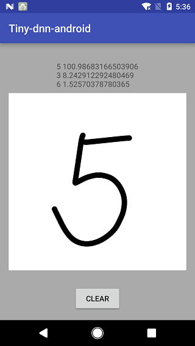

# tiny-dnn for Android

Run AlexNet benchmark using tiny-dnn at first time launch.
Afterwards, run LeNet model to recognize handwritten digit.

##Build
  Simply importing this project to Android Studio of a version higher than 2.2 should work.
